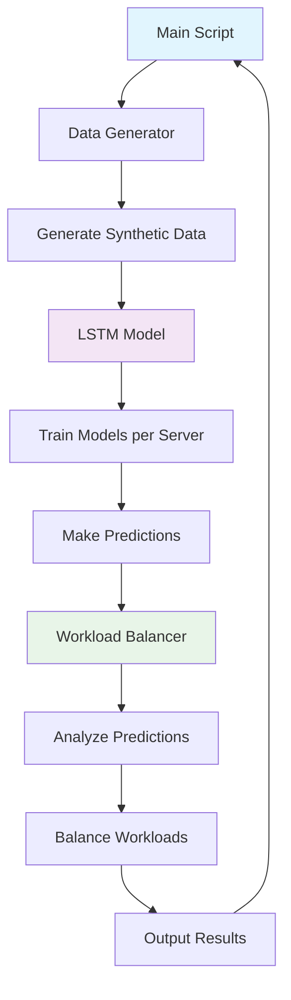

# Smart DevOps Workload Balancer Architecture Diagram

## Overview
The Smart DevOps Workload Balancer is a machine learning-based system that uses LSTM models to predict server CPU usage and dynamically balance workloads across multiple servers. The architecture consists of four main components that work together to generate data, train models, make predictions, and perform balancing.

## Components

### 1. Data Generator (`data_generator.py`)
- **Purpose**: Generates synthetic workload data for training and testing.
- **Inputs**: None (uses random generation).
- **Outputs**: Pandas DataFrame with timestamp, server_id, and cpu_usage columns.
- **Key Features**: Creates time-series data simulating real server workloads.

### 2. LSTM Model (`lstm_model.py`)
- **Purpose**: Defines, trains, and uses LSTM neural networks for CPU usage prediction.
- **Inputs**: Training data from Data Generator.
- **Outputs**: Trained models and predictions for future CPU usage.
- **Key Features**: Time-series forecasting using TensorFlow/Keras LSTM layers.

### 3. Workload Balancer (`workload_balancer.py`)
- **Purpose**: Implements logic to balance workloads based on predictions.
- **Inputs**: Predictions from LSTM models.
- **Outputs**: Balancing decisions (e.g., redistribute tasks).
- **Key Features**: Threshold-based balancing, simulation of workload redistribution.

### 4. Main Orchestrator (`main.py`)
- **Purpose**: Coordinates the entire process.
- **Inputs**: Configuration and data paths.
- **Outputs**: Trained models, predictions, and balancing results.
- **Key Features**: Runs data generation, model training, prediction, and balancing in sequence.

## Architecture Flow

```
[Data Generator] --> [LSTM Model] --> [Workload Balancer]
       ^                    |                |
       |                    v                v
       +------------ [Main Orchestrator] <---+
```

## Detailed Flow Diagram



## Data Flow
1. **Data Generation**: Synthetic time-series data is created with timestamps, server IDs, and CPU usage values.
2. **Model Training**: Each server's data is used to train a separate LSTM model.
3. **Prediction**: Trained models predict future CPU usage for each server.
4. **Balancing**: Based on predictions, workloads are redistributed to prevent overload.

## Dependencies
- TensorFlow/Keras for deep learning
- NumPy/Pandas for data manipulation
- Matplotlib for visualization (optional)

## Key Interactions
- Main script initializes all components
- Data flows from generator to model to balancer
- Models are trained once and used for ongoing predictions
- Balancing decisions are made in real-time based on predictions

This architecture enables predictive workload balancing, helping DevOps teams optimize resource utilization and prevent server overloads.
